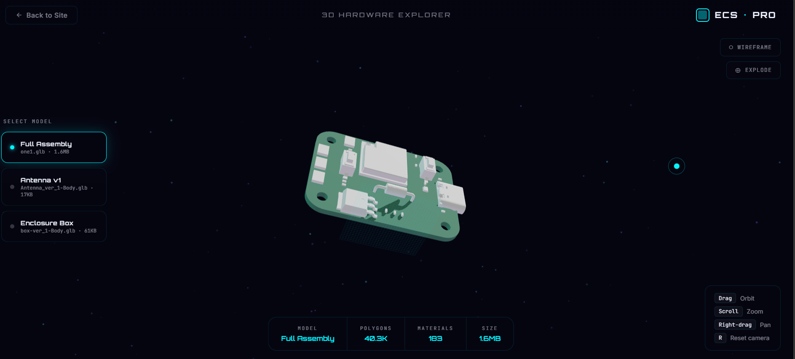
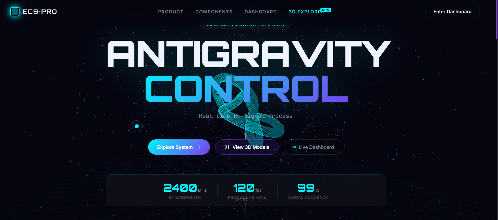
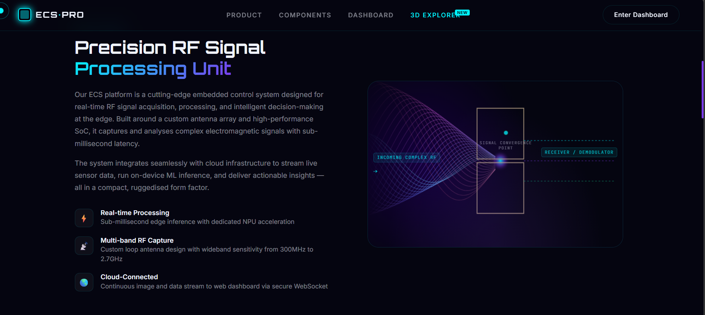
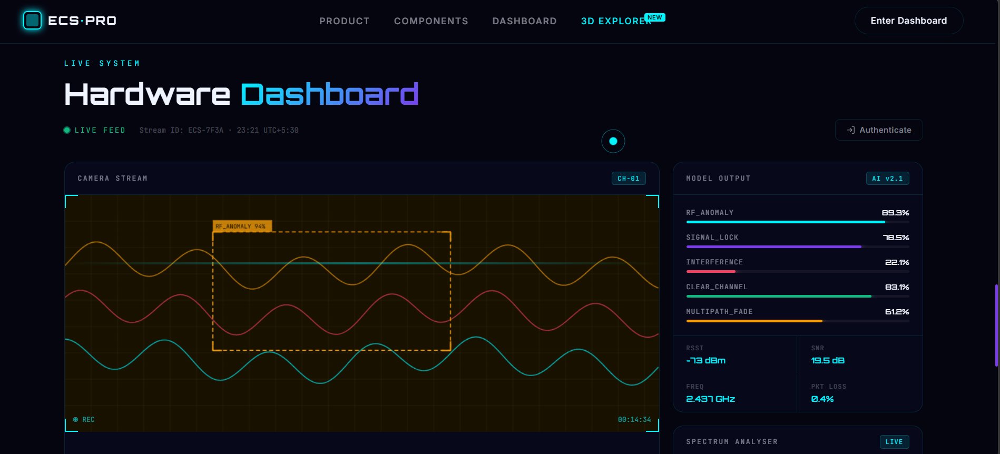

# ECS-2

A professional repository for the ECS-2 project: a Wi-Fi CSI based human presence and activity detection system with a 3D hardware showcase web interface.

## Project Preview

### Main Website




### 3D Explorer




## What this repo contains

- Interactive frontend:
  - `index.html` - main project website/dashboard mockup
  - `model-viewer.html` - 3D model explorer for ECS hardware assets
  - `style.css`, `app.js` - UI styling and interaction logic
- Hardware/engineering assets:
  - `.glb` model files for antenna, enclosure, and full assembly
  - `.step` CAD source for antenna
- Project documentation:
  - `ECS-2 review PDF.pdf` (source review document)
  - `README_DETAILED.md` (full technical documentation)

## Quick start

1. Clone the repository.
2. Open the project folder.
3. Run a static server (recommended):

```powershell
# Option A: Python
python -m http.server 8000

# Option B: Node
npx serve .
```

4. Open:
- `http://localhost:8000/index.html`
- `http://localhost:8000/model-viewer.html`

## Python dependencies

A `requirements.txt` is included for CSI processing and deep learning pipeline work. It is optional for the static web UI.

```powershell
python -m venv .venv
.\.venv\Scripts\Activate.ps1
pip install -r requirements.txt
```

## Repository standards added

- `.gitignore`
- `.editorconfig`
- `.gitattributes`
- `requirements.txt`
- `README.md` (brief)
- `README_DETAILED.md` (detailed)

## Next recommended step

See `README_DETAILED.md` for architecture, roadmap, datasets, model training assumptions, and contribution workflow.
